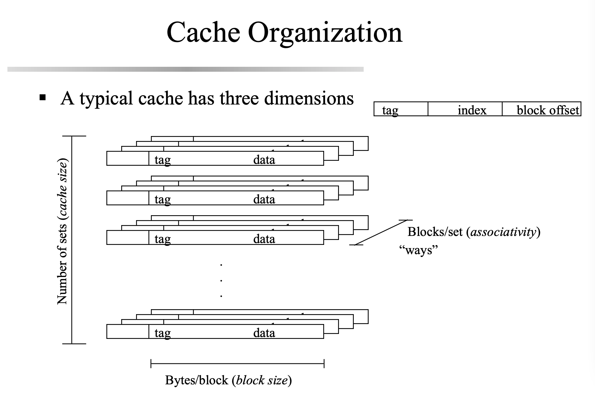
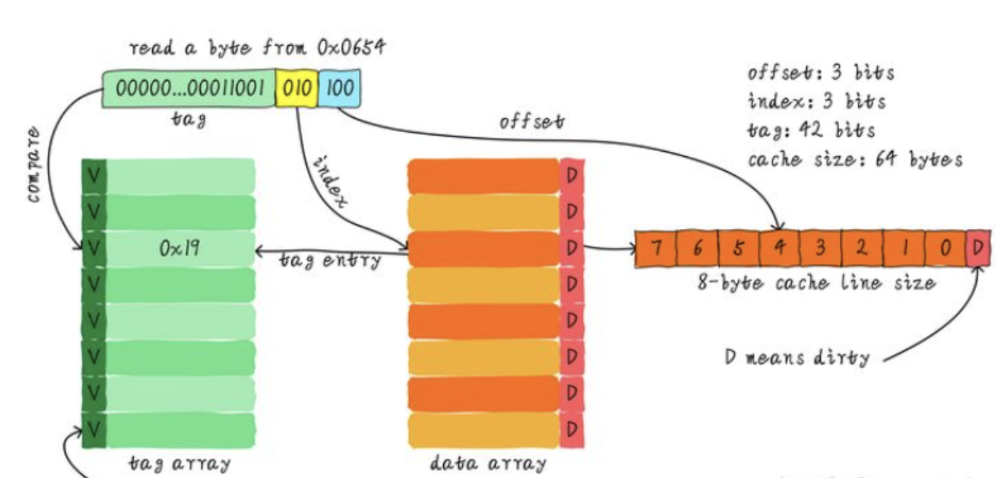

# Prepare  
- follow 说明.txt to compile the original repo.
[Solutions to some potential problem](https://9to5answer.com/quot-fatal-error-bits-libc-header-start-h-no-such-file-or-directory-quot-while-compiling-htk)  
- `make` to get 
```
g++-4.4 -o sim_cache -O3 -m32 -Wall   main.o world.o -lm
-----------DONE WITH SIM_CACHE-----------
my work is done here...
```
- `./sim_cache 32 8192 4 0 1 gcc_trace.txt` to get  
```
Receive the Input!

argument #0 = ./sim_cache
argument #1 = 32
argument #2 = 8192
argument #3 = 4
argument #4 = 0
argument #5 = 1
argument #6 = gcc_trace.txt
```


# Do it  
- [parameters](https://www.runoob.com/w3cnote/c-the-structure-of-the-parameter.html)

Problems:
- parts of address missed, 
```
r 40051
r 40051
r 40048248
```
  - Reason: `unsigned address;`, [Solved]: convert from hex to dec.


-   

- 

